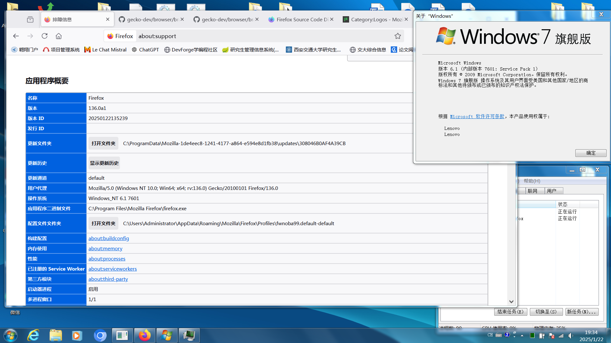

# Firefox for windows 7
Firefox is the fast, lightweight, privacy-focused browser that works across all your devices.

Firefox 115 is the last version to support Windows 7. This repository includes patches that enable Firefox to run on Windows 7 beyond the official end-of-support date, allowing users to continue using the latest features and improvements from Firefox.

## Platform Support

Windows 7, 8, 10, 11.



## FAQ

1. The minimize/maximize/close buttons get hidden with lightweight theme with hardware acceleration enabled

   This is a bug that I currently cannot resolve. However, you can work around it by following step:

   - In `about:config` toggle `media.hardware-video-decoding.enabled` to `false`, toggle `gfx.webrender.software` to `true`

2. How to change language?

   - Download language packs from [here](https://github.com/e3kskoy7wqk/Firefox-for-windows-7/releases).
   - In `about:config` toggle `extensions.langpacks.signatures.required` to `false`, toggle `xpinstall.signatures.required` to `false`, toggle `intl.multilingual.downloadEnabled` to `true`, toggle `intl.multilingual.enabled` to `true`
   - Open the langpack for target locale (eg `firefox-136.0a1.en-CA.langpack.xpi` if you want an `en-CA` locale).
   - In `about:preferences` click "Set Alternatives" under "Language", move desired locale to the top position, click OK, click "Apply And Restart"

## Building

1. Bootstrap a copy of the Firefox source code

   ```bat
   git clone https://github.com/mozilla/gecko-dev.git
   ```

   This repository contains patches for specific versions of Firefox, stored in directories named `<DATE>.<commit_id>`. Here, `commit_id` is the commit ID of Firefox, and `DATE` is purely for File Explorer.

   ```bat
   cd gecko-dev
   git checkout <commit_id>
   ./mach bootstrap
   ```

2. Building [Rust](https://github.com/rust-lang/rust) on Windows MSVC

   To ensure that `rustc` always generates programs compatible with Windows 7, Rust needs to be patched. This repository contains files named `Rust<rust_version>win7.diff` for this purpose, where `rust_version` is the version of Rust used to build Firefox, as specified [here](https://github.com/mozilla/gecko-dev/blob/master/docs/writing-rust-code/update-policy.md).

   - Clone the source with `git`

     ```bat
     git clone https://github.com/rust-lang/rust.git
     cd rust
     git checkout <rust_version>
     ```

   - Apply patch

     ```bat
     git apply --verbose --ignore-space-change Rust<rust_version>win7.diff
     ```

   - Build

     ```bat
     python x.py build --target i686-pc-windows-msvc,x86_64-pc-windows-msvc
     python x.py build library --target i686-pc-windows-msvc,x86_64-pc-windows-msvc
     ```

3. Compiling [Cargo](https://github.com/rust-lang/cargo) from Source

   - Clone the source with `git`

     ```bat
     git clone https://github.com/rust-lang/cargo.git
     cd cargo
     ```

   - With `cargo` already installed by ./mach bootstrap, you can simply run:

     ```bat
     cargo build --release
     ```

4. Apply patches

   Navigate to the `<DATE>.<commit_id>` directory, modify the `REPO_PATH` variable in `apply_patches.bat` to the path of the Firefox source, and then double-click it to apply the patches.

5. Build Firefox

   - Add our custom-built `rustc.exe` and `cargo.exe` to your PATH, delete or rename `%USERPROFILE%\.rustup` and `%USERPROFILE%\.cargo`, and remove any other instances of `rustc.exe` and `cargo.exe` from your PATH.

   - mozconfig for i686-pc-windows-msvc:

     ```bash
     ac_add_options --target=i686-pc-windows-msvc
     ac_add_options --enable-optimize
     ac_add_options --enable-official-branding
     ac_add_options --enable-release
     ac_add_options --disable-sandbox
     ac_add_options --disable-tests
     ```

   - mozconfig for x86_64-pc-windows-msvc:

     ```bash
     ac_add_options --target=x86_64-pc-windows-msvc
     ac_add_options --enable-optimize
     ac_add_options --enable-official-branding
     ac_add_options --enable-release
     ac_add_options --disable-tests
     ```

   - ```bash
     ./mach build
     ./mach package
     ./mach build installers-AB-CD
     ```
